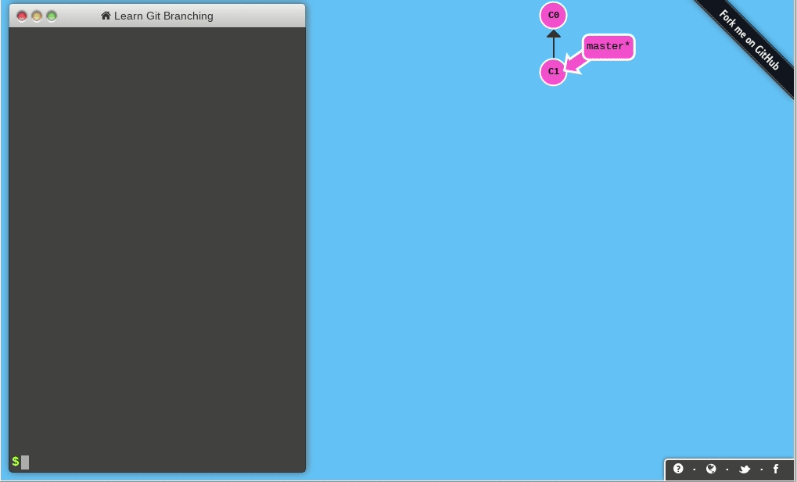

# Project 1: Doubly Linked Lists

**Due: Friday, September 13th at 9:00 PM ET**

# Assignment Overview

Doubly linked lists (DLLs) are a fundamental data structure used to store sequential information. DLLs consist of a chain of _nodes_ linked to one another by _forward_ and _backward_ references, such that one may traverse the chain from the _head_ to the _tail_, or vice-versa. Each node stores a _value_, which may be a number, string, or more complex object.


Traditional _arrays_ provide a simpler means for storing sequential information, but come with a major drawback which DLLs avoid: arrays require contiguous blocks of memory, while DLLs may utilize memory wherever it is available. In settings where data is updated, manipulated or deleted frequently, DLLs outperform traditional arrays by avoiding the need for memory reallocation. [This article](https://www.geeksforgeeks.org/linked-list-vs-array/) gives a nice overview of the distinction between DLLs and arrays.

For more information on Doubly Linked Lists, please visit [Zybooks Chapter 20](https://learn.zybooks.com/zybook/MSUCSE331Spring2024/chapter/20/section/5).

# Assignment Notes

1. Time **and** space complexity account for 30% of the points on Project 1. Be sure to review the rubric and adhere to complexity requirements!
2. Docstrings (the multi-line comments beneath each function header) are provided in Project 1 to serve as an example for future reference. In future projects, docstrings will not be provided, and will need to be completed by you for full credit.
3. Testcases are your friend: before asking about the form of input/output or what happens in a particular edge case, check to see if the test cases answer your question for you. By showing the expected output in response to each input, they supplement the specs provided here.
4. Don't be afraid to go to D2L Course Tools for tutorial videos on how to debug, it will help you figure out where you're going wrong far more quickly than ad-hoc print statements!
5. Throughout the specs, we mention Python double-underscore "magic" methods. These are central to the structure of object-oriented programming in Python, and will continue to appear in future projects in CSE 331 and beyond. [This page](https://rszalski.github.io/magicmethods/) is a great reference if you'd like to learn more about how they work!
6. There are two functions which may seem a little odd to you _\_find_nodes_ and _\_remove_node_. These functions are intended as helper functions to help you reuse code and allow you to practice writing modular code.
7. We **strongly** encourage you to avoid calling `remove` in `remove_all`. Why? It's far less efficient to repeatedly call `remove`, as each call to remove begins searching at the beginning of the list. In the worst case, this will lead our function to operate with O(n^2) time complexity, **violating the required time complexity.**
8. We **strongly** encourage you to implement reverse in-place, without creating any new Node objects and instead rearranging prev and next pointers. Why? It's far less efficient to rebuild the DLL than it is to simply adjust references, as it's far more work to construct a brand new Node object than it is to simply adjust an existing one's references.
9. In the testcases for this project, you will notice the use of assertEqual and assertIs. What's the difference? It ties back to the difference between **==** and **is** in Python. The double-equal sign compares _values_ in Python, while the **is** operator compares _memory addresses_ in Python. Put simply, the **is** keyword is stronger than ==: if two objects are at the same memory address, they must contain the same value. However, it is possible for two objects _not_ at the same memory address to have the same value. In other words, if a is b then we know a == b as well, but if a == b we cannot conclude a is b. A great read on the subject is [available here](https://realpython.com/courses/python-is-identity-vs-equality/).


# Assignment Specifications

**class Node:**

A class that implements the nodes to be created for a DLL.

_DO NOT MODIFY the following attributes/functions_

- **Attributes**
  - **value: T:** Value held by the Node. Note that this may be any type, such as a str, int, float, dict, or a more complex object.
  - **next: Node:** Reference to the next Node in the linked list (may be None).
  - **prev: Node:** Reference to the previous Node in the linked list (may be None).
  - **children_branch: GitBranch:** Reference to a branch originating from this node. Note: this will only be used for the application problem. **You can change the type of this variable if you want**, but you **CANNOT** create any other attributes on this class.
- **\_\_init\_\_(self, value: T, next: Node = None, prev: Node = None) -> None**
  - Constructs a doubly linked list node.
  - **value: T:** Value held by the Node.
  - **next: Node:** Reference to the next Node in the linked list (may be None).
  - **prev: Node:** Reference to the previous Node in the linked list (may be None).
  - **Returns:** None.
- **\_\_str\_\_(self) -> str** and **\_\_repr\_\_(self) -> str**
  - Represents the Node as a string.
  - Note that Python will automatically invoke this function when using printing a Node to the console, and PyCharm will automatically invoke this function when displaying a Node in the debugger.
  - As with all double-underscore "magic" methods in Python (see note 5), this function may be called with str(node) or repr(node). It is not necessary (and stylistically improper) to use node.\_\_str\_\_() or node.\_\_repr\_\_(), just as it is preferable to call len(some_list) instead of some_list.\_\_len\_\_().
  - **Returns:** str.

**class DLL:**

A class that implements the doubly linked list with previous and forward references.

_DO NOT MODIFY the following attributes/functions_

- **Attributes**
  - **head: Node:** Head (first node) of the doubly linked list (may be None).
  - **tail: Node:** Tail (last node) of the doubly linked list (may be None).
  - **size: int:** Number of nodes in the doubly linked list.
  - Note that the implementation in this project does not use a [sentinel node](https://en.wikipedia.org/wiki/Sentinel_node). As such, an empty DLL will have head and tail attributes which are None.
- **\_\_init\_\_(self) -> None**
  - Construct an empty DLL. Initialize the head and tail to None, and set the size to zero.
  - **Returns:** None.
- **\_\_str\_\_(self) -> str** and **\_\_repr\_\_(self) -> str**
  - Represents the DLL as a string of the form "value <-> value <-> ... <-> value."
  - Note that Python will automatically invoke this function when printing a DLL to the console, and PyCharm will automatically invoke this function when displaying a DLL in the debugger.
  - As with all double-underscore "magic" methods in Python (see note 5), this function may be called with str(dll) or repr(dll). It is not necessary (and stylistically improper) to use dll.\_\_str\_\_() or dll.\_\_repr\_\_(), just as it is preferable to call len(some_list) instead of some_list.\_\_len\_\_().
  - **Returns:** str.

_IMPLEMENT the following functions_

- **empty(self) -> bool**
  - Returns a boolean indicating whether the DLL is empty.
  - _Required time complexity:_ O(1).
  - _Required space complexity:_ O(1).
  - **Returns:** True if DLL is empty, else False.
  - Since this method is simply checking if the doubly linked list (DLL) is empty (likely by verifying if the head of the list is `None` or if the size of the list is 0), its space complexity is O(1). 
- **push(self, val: T, back: bool = True) -> None**
  - Adds a Node containing val to the back (or front) of the DLL and updates size accordingly.
  - _Required time complexity:_ O(1).
  - _Required space complexity:_ O(1).
  - **val: T:** Value to be added to the DLL.
  - **back: bool:** If True, add val to the back of the DLL. If False, add to the front. Note that the default value is True.
  - **Returns:** None.
  - The act of pushing a value onto a DLL involves creating a new node and adjusting a couple of pointers (previous and next). It doesn't matter how long the DLL is; the process of adding a node requires a fixed amount of space. Hence, its space complexity remains `O(1)`.
- **pop(self, back: bool = True) -> None**
  - Removes a Node from the back (or front) of the DLL and updates size accordingly.
  - In the case that the DLL is empty, pop does nothing.
  - _Required time complexity:_ O(1).
  - _Required space complexity:_ O(1).
  - **back: bool:** If True, remove from the back of the DLL. If False, remove from the front. Note that the default value is True.
  - **Returns:** None.
  - Popping a value from the DLL involves adjusting pointers and, in some implementations, deallocating the node's memory. Like the push method, the space it requires doesn't depend on the size of the DLL. Therefore, its space complexity is `O(1)`.
- **list_to_dll(self, source: list[T]) -> None**
  - Creates a DLL from a standard Python list. If there are already nodes in the DLL, the DLL should be cleared and replaced by **source**.
  - Hint: clearing the DLL can be very simple. Think about what an empty DLL looks like (what are the values of head and tail?).
  - _Required time complexity:_ O(n).
  - _Required space complexity:_ O(n).
  - **source: list[T]:** Standard Python list from which to construct DLL.
  - **Returns:** None.
  - When transforming a standard Python list into a DLL, the method will likely iterate over each item in the source list and create a new node in the DLL. The number of nodes created will be proportional to the size of the source list. Thus, in the worst-case scenario, if the source list contains 'n' elements, the method will require space for 'n' nodes. Hence, its space complexity is `O(n)`, meaning it requires linear space relative to the size of the input list.
- **dll_to_list(self) -> list[T]**
  - Creates a standard Python list from a DLL.
  - _Required time complexity:_ O(n).
  - _Required space complexity:_ O(n).
  - **Returns:** list[T] containing the values of the nodes in the DLL.
- **def \_find_nodes(self, val: T, find_first: bool =False) -> List[Node]:**
  - Construct list of Node with value val in the DLL and returns the associated Node object list
  - _Required time complexity:_ O(n).
  - _Required space complexity:_ O(n).
  - MUST BE CALLED FROM find AND find_all
    - If find and find_all do not call \_find_nodes, **all testcase and manual points** for find and find_all will be forfeited.
  - Will not be tested explicitly
    - Tests for find and find_all will ensure functionality
  - **val: T:** Value to be found in the DLL.
  - **find_first: bool:** if True find only the first element in the DLL, it false find all instances of the elements in the DLL.
  - **Returns:** list of Node objects in the DLL whose value is val. If val does not exist in the DLL, returns empty list.
- **find(self, val: T) -> Node**
  - Finds first Node with value val in the DLL and returns the associated Node object.
  - _Requires call to_ \_find_nodes
    - Failure to call \_find_nodes will result in **all testcase and manual points** being forfeited for find.
  - _Required time complexity:_ O(n).
  - _Required space complexity:_ O(1).
  - **val: T:** Value to be found in the DLL.
  - **Returns:** first Node object in the DLL whose value is val. If val does not exist in the DLL, return None.
- **find_all(self, val: T) -> list[Node]**
  - Finds all Node objects with value val in the DLL and returns a standard Python list of the associated Node objects.
  - _Requires call to_ `_find_nodes`
    - Failure to call `_find_nodes` will result in **all testcase and manual points** being forfeited for find_all.
  - _Required time complexity:_ O(n).
  - _Required space complexity:_ O(n).
  - **val: T:** Value to be found in the DLL.
  - **Returns:** standard Python list of all Node objects in the DLL whose value is val. If val does not exist in the DLL, returns an empty list.
- **\_remove_node(self, to_remove: Node) -> None**
  - Given a reference to a node in the linked list, remove it
  - MUST BE CALLED FROM `remove` AND `remove_all`
  - Will not be tested explicitly
    - Tests for remove and remove_all will ensure functionality
  - _Required time complexity:_ O(1).
  - _Required space complexity:_ O(1).
  - **to_remove: Node:** Node to be removed from the DLL.
  - **Returns:** None.
- **remove(self, val: T) -> bool**
  - removes first Node with value val in the DLL.
  - MUST CALL `remove_node`
    - Failure to call `remove_node` will result in **all testcase and manual points** being forfeited for remove.
  - Hint
    - Use of `find` allows this to be implemented in less than 10 lines.
  - _Required time complexity:_ O(n).
  - _Required space complexity:_ O(1).
  - **val: T:** Value to be removed from the DLL.
  - **Returns:** True if a Node with value val was found and removed from the DLL, else False.
- **remove_all(self, val: T) -> int**
  - removes all Node objects with value val in the DLL. See note 7.
  - MUST CALL `remove_node`
    - Failure to call `remove_node` will result in **all testcase and manual points** being forfeited for remove_all.
  - Hint
    - Use of `find_all` allows this to be implemented in less than 10 lines.
  - _Required time complexity:_ O(n).
  - _Required space complexity:_ O(n).
  - **val: T:** Value to be removed from the DLL.
  - **Returns:** number of Node objects with value val removed from the DLL. If no node containing val exists in the DLL, returns 0.
- **reverse(self) -> None**
  - Reverses the DLL in-place by modifying all next and prev references of Node objects in DLL. Updates self.head and self.tail accordingly. See note 8.
  - _Required time complexity:_ O(n).
  - _Required space complexity:_ O(1).
  - **Returns:** None.

# Application Problem: Git Simulator


Finally, you were able to go back in time, to the dawn of computers, and now you can be the master of all computers with your knowledge about the future!

But when creating your first company and hiring the first developers to conquer the world, you notice that Git, the famous version control software, hasn't been created yet, and that is a major bummer in your plans, you must fix this by building a simple git simulator system in order to save your company and conquer the world!

Fortunatelly you remember that **DLLs** are the perfect data structure for such a situation.

## What is Git?

Git is a source and version control system, created by Linus Torvalds (yes, one of the founders of Linux, talk about changing the world right?). Git was created in 2005 to solve a VERY common problem, maintaining different versions of code, and keeping track of current versions, changes, authors and all that metadata in an organized way.

You might ask, how was this done before? There were several approaches to this problem. Several companies had created software that did version control, but only a selected few were free, and according to Torvalds, none of them were amazing. Another way that was common was naming projects folders "project-v1", "project-v2", "project-final", "project-real-final", but you can imagine how scalable that idea really was...

Since 2005 git has become the main way version control is done, it is fast, reliable and scalable in a way never seen before, and nothing better has been created. It is the standard in the industry, and a great tool to have in your toolbelt!

Not to be confused with Github or Gitlab. Github is a hosting service (a very good one) that keeps all your files on the cloud, and works together with Git to keep track of version control easily. Think of Github like Google Drive and git like your local files. You have your files on your local machine, but it is easy to save and share them on Google Drive.

## How is Git used?

The objective of Git is to save files and see what was different on every "block" of changes done on the files. This block of changes is called `commit`. After changing files A, B, and C a developer can `commit` the changes to the Git repository (Git's name for folders), effectively saving the files into the history of changes. Then the developer `push` the changes to a remote repository, like Github, and other developers can `pull` the changes, downloading them to their local machines. This is the basic idea, but we highly recommend you do some more research, even though it won't be necessary for the project.

Another **essential** feature of Git is branching. Branches allow developers to keep parallel versions of code, as if creating a different timeline. One use of branches is to test new features, you can create a branch, test a new feature and implementation, and if it does not work, you can go back, and pretend it never happened. The command used to go to a branch, and to create a branch for the project, is `checkout`. It tells git to `checkout` the branch and change all the files to be the files on that branch. `checkout` can also be used to move to commits, changing all the files to be how they were after that commit was done.

## How does Git work for the project?

Real Git uses a very effective, but rather simple idea of only storing files that changed, and keeping pointers to files that have not changed. That way, git stores less data to keep the same information, it can also change files very fast, as it just needs to change the pointers to the files it wants.

For the project, that would be a little complicated. Our Git system will store only the messages for commits, a description of what was changed in that commit. It will also allow users to create branches, starting from any commit.

For example:

```
'''Empty Repo'''
git = Git()

'''Hello'''
git.commit("Hello")

'''Hello -> World'''
git.commit("World")

'''Hello -> World -> I am Git'''
git.commit("I am Git")

git.get_current_commit() -> "I am Git"

'''Hello -> World (current commit) -> I am Git'''
git.backwards()
git.get_current_commit() -> "World"

'''
Hello -> World (current commit) -> I am Git (main-branch)
          |
          (new-feature-branch)
'''
git.checkout_branch("new-feature")

'''
Hello -> World -> I am Git (main-branch)
          |
          Testing something (current commit)(new-feature-branch)
'''
git.commit("Testing something")
git.get_current_commit() -> "Testing something"

'''
Hello -> World -> I am Git (current commit)(main-branch)
          |
          Testing something (new-feature-branch)
'''
git.checkout_branch("main")
git.get_current_commit() -> "I am Git"
```

## Git Simulator using DLL Description

You will create a Git simulator that will store and keep track of commit messages. Your Git system will support:

- Creating commits
- Going back and forth on the commit timeline of messages
- Creating unlimited branches, but only one branch can be created from a specific commit (i.e. one commit cannot have more than one branch originating from it)
- Checking out branches, setting the current state to be the last commit on that branch.
- Checking out commits, moving the current state to that commit, and changing the branch to the parent branch for that commit.

**You ARE required to use a DLL to implement the simulator in some way. However, we do not check specific pointers or nodes, but the end result of calling the functions. This is a common approach to Test-Driven Development (TDD), testing the outcomes, not how something is done. You are free to implement it however you want, as long as you have the functions we specify, and use a DLL.**

## Function Description

- Whenever raising exceptions, use the Exception class. The error message you choose does not matter for grading purposes, but as a good standard, it should include a meaningful error message.

**GitBranch(DLL) class**:

- **You will use this class in the following class Git.** It inherits from the DLL class. We use it to represent the branch structure on the tree.
- How to call methods from the base class? You can use the `super()` function. We used it on the push method like `super().push(value)`. This will call the DLL push method, and we can add extra functionality to it. More information can be found [here](https://www.programiz.com/python-programming/inheritance). This is a simple introduction of the wonders of Object-Oriented Programming, something you will learn more about on CSE 335.
- We use the `__slots__` attribute to allocate space for each attribute. If you change any of the attribute's name, remember to change the `__slots__` variable.

- **Attributes**
  - **name: str:** The name of the GitBranch.
  - **parent_node: Node:** A reference to the parent node of the branch.
- **\_\_init\_\_(self, name: str = "main", parentNode: Node = None)**
  - Initializes the attributes for the class.
  - **name**: The name of the branch.
  - **parent_node**: The node the tree originates from.
- **push_commit(self, value: T) -> Optional[Node]:**
  - Pushes a value in the Git timeline, by adding a new node to the back
  - We used it in the `commit` function of `Git`
  - **value: T:** The value to be pushed to the branch
  - **Returns:** The new last node in the DLL
- **get_first_commit(self) -> Node:**
  - Gets the first commit of the tree
  - **Returns:** The first commit on the tree
- **get_last_commit(self) -> Node:**
  - Gets the last commit of the branch
  - **Returns:** The last commit on the branch

**class Git:**

- **Attributes**
  - **start: GitBranch:** This attribute holds a reference to the initial branch of the Git timeline.
    - It serves as the starting point for the Git history, from which all other branches and commits originate. In official Git, it is commonly known as `main` or `master`.
  - **current_branch: GitBranch:** This attribute holds a reference to the currently active branch in the Git timeline. It allows the Git system to keep track of the branch the user is currently working on, enabling operations like committing new changes or navigating through commits.
  - **selected_commit: Node:** This attribute holds a reference to the current commit (node) in the active branch. It represents the current state or the latest commit in the timeline that the user is working on. It's essential for operations like committing new changes or moving to different commits.
  - **visited_branches: set:** This attribute holds a set of branch names that have been visited during `forward` and `backward` operations. It ensures that the system knows which branches have been traversed, and could help knowing where to go next. Hint: Should be used on forward and backward methods...
- **\_\_init\_\_(self) -> None**
  - Initiallizes the class, creates required variables.

**YOU ARE TASKED WITH IMPLEMENTING THE FOLLOWING FUNCTIONS**

- **get_current_commit(self) -> Optional[str]**
  - Gets the value stored in the currently selected commit.
  - _Required time complexity:_ O(1).
  - _Required space complexity:_ O(1).
  - **Returns:** The value stored in the currently selected commit. If there is no commit yet return None.
- **get_current_branch_name(self) -> Optional[str]**
  - Return the name of the selected branch
  - _Required time complexity:_ O(1).
  - _Required space complexity:_ O(1).
  - **Returns:** Return the name of the selected branch, If there is no branch return None.
- **commit(self, message: str) -> None**
  - Saves a commit to the current selected branch.
  - If the currently selected commit is not the last commit in the branch, raises an Exception with the message "Can't commit in middle of timeline".
  - **message: str:**: Commit message to be saved to the tree.
  - _Required time complexity:_ O(1).
  - _Required space complexity:_ O(1).
- **backwards(self) -> None**
  - Moves the reference of the currently selected commit to be the commit before the current one.
  - If already on first commit, do nothing.
  - Does not change the current branch selection.
  - _Required time complexity:_ O(1).
  - _Required space complexity:_ O(1).
- **forward(self) -> None**

  - Moves the reference of the currently selected commit to be the commit after the current one.
  - If already on the last commit, do nothing.
  - Does not change the current branch selection.
  - _Required time complexity:_ O(1).
  - _Required space complexity:_ O(1).

  The following examples are for forward movements and backwards movements. More examples can be found in tests.py.

  Example 1: backwards

  ```
  '''
  Hello -> World -> I am Git (main-branch)
            |
          Testing something -> Other test -> Refactoring (current selected commit)(selected branch)(new-feature-branch)
            |
          Some other feature (other-feature-branch)
  '''

  git.backwards()

  '''
  Hello -> World -> I am Git (main-branch)
            |
          Testing something -> Other test (current selected commit) -> Refactoring (selected branch)(new-feature-branch)
            |
          Some other feature (other-feature-branch)
  '''
  ```

  Example 2: backwards

  ```
  '''
  Hello -> World -> I am Git (main-branch)
            |
          Testing something -> Other test (current selected commit) -> Refactoring (selected branch)(new-feature-branch)
            |
          Some other feature (other-feature-branch)
  '''

  git.backwards()
  git.backwards()
  git.backwards()

  '''
  Hello (current selected commit) -> World -> I am Git (main-branch)
                                       |
                                     Testing something -> Other test -> Refactoring (selected branch)(new-feature-branch)
                                       |
                                     Some other feature (other-feature-branch)
  '''
  ```

  Example 3: forwards

  ```
  '''
  Hello (current selected commit) -> World -> I am Git (main-branch)
                                       |
                                     Testing something -> Other test -> Refactoring (selected branch)(new-feature-branch)
                                       |
                                     Some other feature (other-feature-branch)
  '''

  git.forward()

  '''
  Hello -> World (current selected commit) -> I am Git (main-branch)
            |
          Testing something -> Other test -> Refactoring (selected branch)(new-feature-branch)
            |
          Some other feature (other-feature-branch)
  '''
  ```

  Example 4: forwards

  - Note how the current selected commit goes to the `Refactoring` commit, not `I am Git`.
  - This happens as `forward` moves the current selected commit in the selected branch, which is `new-feature-branch`.

  ```
  '''
  Hello -> World (current selected commit) -> I am Git (main-branch)
            |
          Testing something -> Other test -> Refactoring (selected branch)(new-feature-branch)
            |
          Some other feature (other-feature-branch)
  '''

  git.forward()
  git.forward()
  git.forward()

  '''
  Hello -> World -> I am Git (main-branch)
            |
          Testing something -> Other test -> Refactoring (current selected commit)(selected branch)(new-feature-branch)
            |
          Some other feature (other-feature-branch)
  '''
  ```

The following four methods have already been implemented for you. Please do NOT modfiy them in starter.py.
The four methods are called in tests.py. We provide the four methods so you can read them and understand them. `forward` and `backwards` will need to use the attributes changed by them, especially `visited`.

- **checkout_branch(self, name: str) -> None**

- **checkout_commit(self, message: string) -> None**

- **find_branch(self, start: GitBranch, name: str) -> GitBranch | None**

- **find_commit(self, start: GitBranch, message: str) -> Tuple[GitBranch, Node] | None**

Here is some music for you to listen while working on this project:
[Chillstep Music for Programming](https://youtu.be/M5QY2_8704o)

## **Submission Guidelines**

### **Deliverables:**

For each project, a `solution.py` file will be provided. Ensure to write your Python code within this file. For best results:

- 📥 **Download** both `solution.py` and `tests.py` to your local machine.
- 🛠️ Use **PyCharm** for a smoother coding and debugging experience.

### **How to Work on a Project Locally:**

Choose one of the two methods below:

---

#### **APPROACH 1: Using D2L for Starter Package**

1. 🖥️ Ensure PyCharm is installed.
2. 📦 **Download** the starter package from the _Projects_ tab on D2L. _(See the tutorial video on D2L if needed)_.
3. 📝 Write your code and, once ready, 📤 **upload** your `solution.py` to Codio. _(Refer to the D2L tutorial video for help)_.

---

#### **APPROACH 2: Directly from Codio**

1. 📁 On your PC, create a local folder like `Project01`.
2. 📥 **Download** `solution.py` from Codio.
3. 📥 **Download** `tests.py` from Codio for testing purposes.
4. 🛠️ Use PyCharm for coding.
5. 📤 **Upload** the `solution.py` back to Codio after ensuring the existing file is renamed or deleted.
6. 🔚 Scroll to the end in Codio's Guide editor and click the **Submit** button.

---

### **Important:**

- Always **upload** your solution and **click** the 'Submit' button as directed.
- All project submissions are due on Codio. **Any submission after its deadline ( Thursday, January 25th, 2024 at 9:00 PM ET) is subject to late penalties** .

**Tip:** While Codio can be used, we recommend working locally for a superior debugging experience in PyCharm. Aim to finalize your project locally before submitting on Codio.

---

**Grading**

- **Auto Graded Tests (70 points)** see below for the point distribution for the auto graded tests:

- 01 - test_empty: \_\_/5
- 02 - test_push: \_\_/5
- 03 - test_pop: \_\_/5
- 04 - test_list_to_dll: \_\_/5
- 05 - test_dll_to_list: \_\_/5
- 06 - test_find: \_\_/7
- 07 - test_find_all: \_\_/7
- 08 - test_remove: \_\_/7
- 09 - test_remove_all: \_\_/7
- 10 - test_reverse: \_\_/7
- 11 - test_basic_commit: \_\_/4
- 12 - test_basic_forward_backward: \_\_/5
- 13 - test_branches: \_\_/1

- **Manual (30 points)**

- Time and Space complexity points are **divided equally** for each function. If you fail to meet time **or** space complexity in a given function, you receive half of the manual points for that function.
- Loss of 1 point per missing docstring (max 5 point loss)
- Loss of 2 points per changed function signature (max 20 point loss)
- Loss of complexity and loss of testcase points for the required functions in this project. You may not use any additional data structures such as dictionaries, and sets!”

- M1 - test_empty: \_\_/1
- M2 - test_push: \_\_/2
- M3 - test_pop: \_\_/2
- M4 - test_list_to_dll: \_\_/2
- M5 - test_dll_to_list: \_\_/2
- M6 - test_find_nodes: \_\_/2
  - If find and find_all do not call \_find_nodes, **all testcase and manual points** for find and find_all will be forfeited.
  - If \_find_nodes violates time and/or space complexity and is called by find and find_all (as it must be), **all manual points** will be forfeited for the three functions
- M7 - test_find: \_\_/2
- M8 - test_find_all: \_\_/2
- M9 - test_remove_node: \_\_/2
  - If remove and remove_all do not call \_remove_node, **all testcase and manual points** for remove and remove_all will be forfeited.
  - If \_remove_node violates time and/or space complexity and is called by remove and remove_all (as it must be), **all manual points** will be forfeited for the three functions.
- M10 - test_remove: \_\_/2
- M11 - test_remove_all: \_\_/2
- M12 - test_reverse: \_\_/2
- M13 - test_basic_commit: \_\_/2
- M14 - test_basic_forward_backward: \_\_/4
- M15 - test_branches: \_\_/1

- **Important reminder**
  Note students can not use Chegg or similar sites, see syllabus for details, use of outside resources for the application problem is strictly forbidden, use of outside resources is limited to max of 2 functions in a project.

      * **DOCSTRING** is provided for this project. In the furture it will not be provided. Please use Project 1 as a template for your DOCSTRING .
      To learn more on what is a DOCSTRING visit the following website: [What is Docstring?](https://peps.python.org/pep-0257/)
      In the future:
        * One point per function that misses DOCSTRING.
        * Up to 5 points of deductions

---

Authors of DLL : Andrew McDonald, Alex Woodring, Andrew Haas, Matt Kight, Lukas Richters, Anna De Biasi, Tanawan Premsri, Hank Murdock, & Sai Ramesh

---

## **Upload Checklist**

- <input type="checkbox"> <b> **STEP 1:** Rename the old solution file by clicking the 'Rename' button below. This action will change your file's name to **solution_old.py**.
  {Rename}(mv solution.py solution_old.py)

- <input type="checkbox"> **STEP 2:** Refresh your file tree either by using the refresh button located under the project name or simply refresh your browser.

- <input type="checkbox"> **STEP 3:** Upload your **solution.py** from your local machine to the Codio File Tree on the left. Once uploaded, refresh your file tree or browser to confirm the update.

- <input type="checkbox"> **STEP 4:** Click on the **Submit** button to upload your code. When finished, **Mark** your work as complete. Feel free to submit multiple times; there's no submission limit.

- <input type="checkbox"> **STEP 5:** Ensure you scroll to the very bottom of the **Guide Editor** page (you're currently reading this Guide, which is our specs document). At the end of the document, click on the **Mark as Completed button**. Below, you'll find an image of the button for reference. If you neglect to mark it as complete, Codio will auto-mark it at the conclusion of the final penalty day, resulting in a score of **0** for your project.
  

---

## 📝 **Submission Instructions**

The `Submit` button fetches the `tests.py` file from our secure directory, ensuring it always uses the most recent version. Should there be any updates to `tests.py`, rest assured that students will always have access to the latest version when pressing the submit button.

{SUBMIT!|assessment}(test-3379255259)

> 🚨 **Important Note:** After clicking `Submit`, automated grading will run based on the test cases. However, manual grading follows this step. **30 points** of this project are allocated to manual grading:
>
> - **28 points** for assessing the runtime and space complexity of your solution.
> - **+2 points** for filling out feedback and citing sources in the appropriate text box.

{Check It!|assessment}(grade-book-3266829715)
{Submit Answer!|assessment}(free-text-3024451938)

```

```
